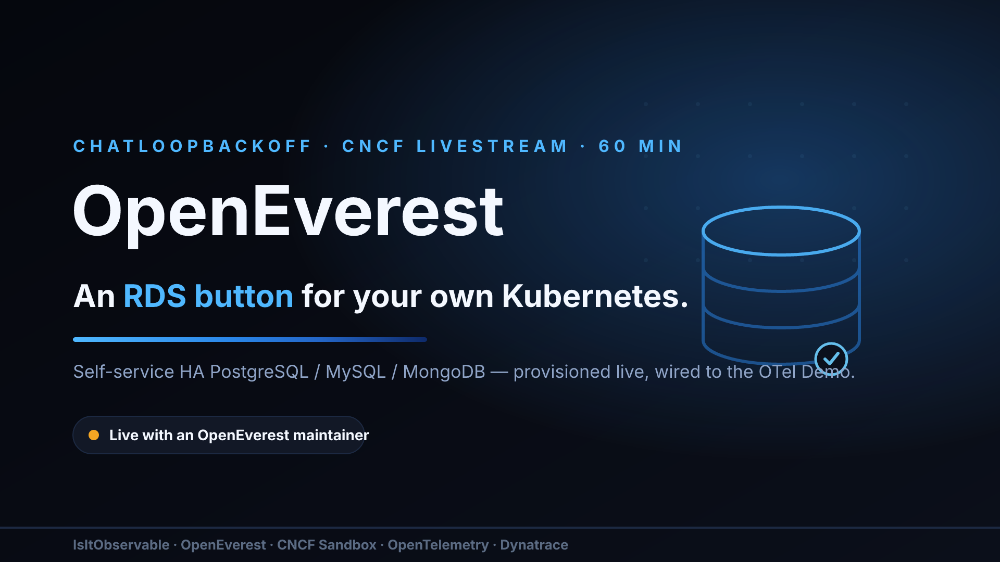
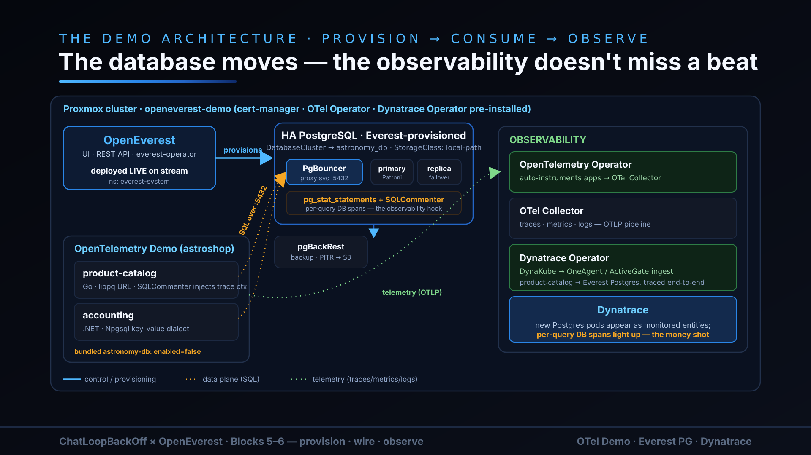

<p align="center">
  
</p>

# ChatLoopBackOff × OpenEverest

> **Companion repo for the CNCF ChatLoopBackOff livestream.** Provision a PostgreSQL
> database with [OpenEverest](https://github.com/openeverest/openeverest), then point
> the [OpenTelemetry Demo](https://github.com/open-telemetry/opentelemetry-demo)'s
> product-catalog + accounting services at it — no app code changes, just Everest and
> connection strings.

Managed databases are the part of the cloud most teams never got to keep. You can
run your entire app platform on Kubernetes — GitOps, autoscaling, progressive
delivery, the works — and still file a ticket, or reach for a cloud RDS instance,
the moment you need a *database*. That gap is where "cloud-native" quietly stops
being cloud-native.

This repo is a hands-on answer to that gap. In one sitting you'll stand up
**OpenEverest** — a Kubernetes-native database-as-a-service control plane — provision
a real, production-shaped **PostgreSQL 17.10** cluster from a single manifest, and then
do the part that makes it feel real: **take a running application off its bundled
database and move it onto the Everest-managed one, live, with zero code changes.** The
application is the [OpenTelemetry Demo](https://github.com/open-telemetry/opentelemetry-demo),
so the whole move is observable end-to-end — you *watch* the storefront's traces start
hitting the new database, and query-level stats light up through `pg_stat_statements`.

Every command and version in this repo was validated against a real cluster on
**2026-09-23** — the eight gotchas we hit during the dry-run are baked into the scripts
and called out in the tutorial, so you walk the paved path instead of rediscovering
the potholes.

## Why this matters

- **A self-service database button, on infrastructure you own.** Everest gives
  developers the RDS experience — pick an engine, click (or `kubectl apply`), get a
  managed, backed-up, connection-ready database — without leaving your cluster or your
  cloud bill's mercy. The control plane is just Kubernetes CRs, so it's GitOps-native
  and reviewable.
- **Stateful services can be declarative too.** The database here is a
  `DatabaseCluster` manifest, not a click-op. The entire demo is `kubectl apply` and a
  few scripts — reproducible, diff-able, and tear-down-able.
- **The migration is the demo.** Swapping a live app's backing store is exactly the
  operation teams are most afraid of. Doing it against the OTel Demo — with distributed
  tracing already wired in — turns a scary migration into a spectator sport: you can
  *see* it work.
- **Observability all the way down to the query.** Because the app is OTel-instrumented
  and Postgres runs `pg_stat_statements`, you get traces *and* database query stats,
  optionally fanned out to Jaeger/Grafana and Dynatrace side by side.

## Watch it live

This repo is the companion to a **CNCF ChatLoopBackOff** livestream episode
("OpenEverest: an RDS button for your own Kubernetes"). You can follow along entirely
from the docs here, but if you want the narrated version — including the live
before/after migration and the observability "money shot" — catch the stream. The
episode walks the same six steps, in the same order, against the same pinned versions.

<p align="center">
  
</p>

## What's here

| Path | What |
|---|---|
| [`docs/tutorial.md`](docs/tutorial.md) | Full end-to-end, copy-paste tutorial (6 steps). |
| [`docs/prerequisites.md`](docs/prerequisites.md) | Cluster + local-tool requirements, pinned versions. |
| [`docs/architecture.md`](docs/architecture.md) | Before/after diagram and design rationale. |
| [`manifests/everest/`](manifests/everest/) | DatabaseCluster CR, seed Job, and the demo→Everest swap overlay. |
| [`manifests/otel-demo/`](manifests/otel-demo/) | Baseline OTel Demo Helm values. |
| [`manifests/dynatrace/`](manifests/dynatrace/) | Optional DynaKube example for Dynatrace observability. |
| [`scripts/`](scripts/) | One script per tutorial step (`00`→`90`). |

## Quickstart

```sh
./scripts/00-prereqs.sh                       # everestctl + Helm repo
helm upgrade --install otel-demo open-telemetry/opentelemetry-demo \
  -n otel-demo --create-namespace --version 0.40.10 -f manifests/otel-demo/values.yaml
./scripts/10-install-everest.sh               # install Everest + PG operator
./scripts/20-provision-postgres.sh            # provision PostgreSQL 17.10
./scripts/30-seed-database.sh                 # load the demo schema/data
EVEREST_LB_IP=<printed above> ./scripts/40-swap-demo.sh   # swap the demo onto Everest
# ... observe in Jaeger/Grafana (bundled) or Dynatrace (optional) ...
./scripts/90-teardown.sh                      # clean up
```

Full walkthrough with explanations: **[docs/tutorial.md](docs/tutorial.md)**.

## Validated versions

everestctl **v1.16.2** · Percona PG operator **v3.0.0** · PostgreSQL **17.10** ·
opentelemetry-demo chart **0.40.10** / app **2.2.0**. See
[docs/prerequisites.md](docs/prerequisites.md).

## License

[Apache-2.0](LICENSE).
